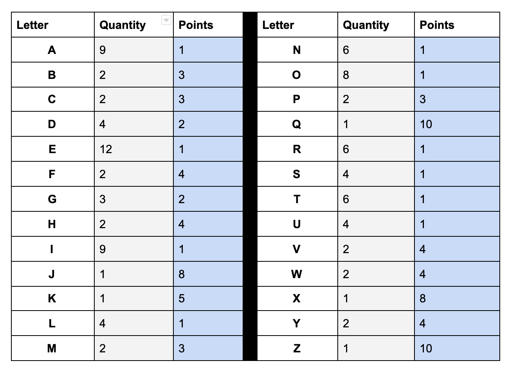

# Sooksma Scramble

## Concept:

- The game itself is a combination of Boggle and Scrabble
- 16 tiles of randomly generated letters on a 4x4 board
- Letters each have a point value
- Make as many words as possible in 60 seconds (for 3 rounds)
- You must hit the points goal to advance to the next round
- The point requirement will increase per round
  - Round 1: 50 points
  - Round 2: 100 points
  - Round 3: 200 points
- Beat 3 rounds to win the game
- Words can be created using “touching” letters - vertically, horizontally, diagonally
- Letters can only be used once per word
- You can only use a word once per round for points
- If user tries to use word again there will be a prompt that says “You’ve already found that word”
- Words must be at least 3 letters long
- User has the ability to pause the clock
  - If the clock is paused, the letters should not be visible
- User has the ability to reset the board
  - If the board is reset, a new board of randomly generated letters will be shown and the user’s points go back to 0
- There will be a running list of used words per round
- At the end of the round, the word values should be added up to get the user’s points for that round
  - If the user hits the required points or exceeds it, they move on to the next round
  - If the user does not meet the points requirement, they go back to round 1

**Letter Values**

**Future Goal: Challenge Mode**

- When a user uses a letter, it disappears and another letter is randomly generated from the “letter bank”
  - There will be a letter bank view, so you can see how many of each letter you have left

**User Stories:**

- View an opening screen that says “Welcome to Sooksma Scramble”
- Opening screen will include an “Instructions” page option
- Click “Start” to open the game at Round 1
  - Encounter a prompt that states “Begin Round 1 - You need 50 points to move on”
  - You will encounter this prompt for each level, should you move on to levels 2 and 3, with the information for each level’s point requirement changing
- When the round starts you will see the timer counting down and your randomly generated letters on the board
- Click the letters to generate the words on the board
  When a word is submit, it will show up on the list on the right side of the screen, along with it’s points value
- The points for all the words (added together) will be tallied at the bottom of the “words box”
- When the clock hits 0
  - If enough points have been accumulated the screen will prompt “Congratulations, it’s time for round 2!”
    - At this point you can move on to the next round, or reset the board (bringing you back to round 1 and 0 points)
  - If not enough points were accumulated the screen will prompt “Better luck next time!”
    - This will bring you back to round 1 and 0 points
  - If enough points are accumulated after round 3 it will prompt “Congratulations! You’ve won!”

## Wireframes:

##Technologies Used:

- HTML
- CSS
- JavaScript
- Bootstrap
- Google Fonts

## Approach:

- I am working on small feats first and then using those to move me forward in the more dynamic parts of the code
- Some areas required hard-coding so that I could move forward, then come back to these issues later to make them less repetative

## Challenges:

- Getting the rounds to change once the timer expired
- Finding a way to get the total points on the board
- Having the letter sqaures reference their corresponding id on the board when generating random letters for the board

## Additional Information:

## App Demo:

https://pksc350.github.io/
